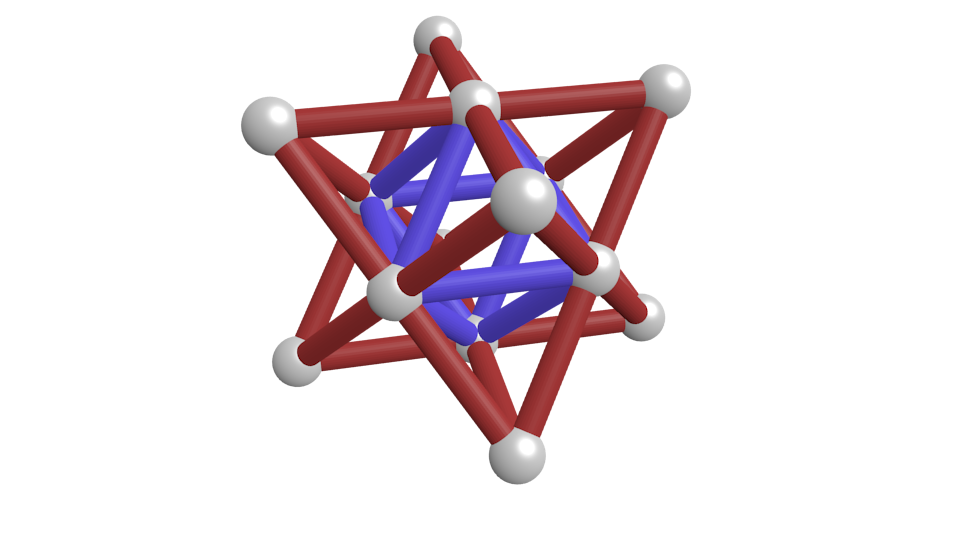
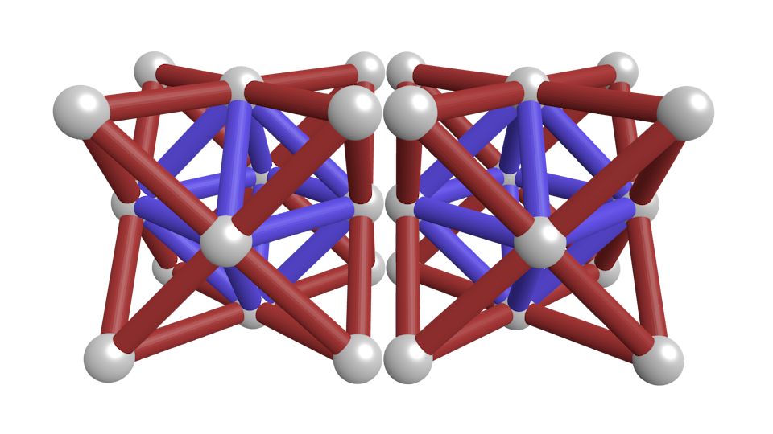
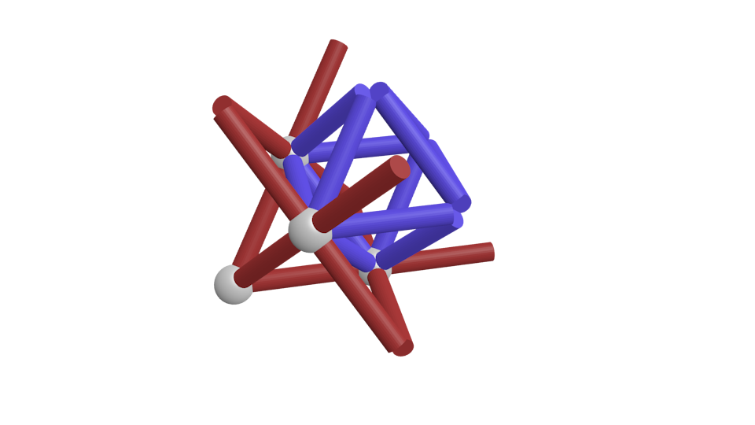

# Code Foo 8 Application

by Andy He

## Table of Contents

- [1. About me](#1-about-me)
- [2. Rebuilding the Eiffel Tower out of Geomags](#2-rebuilding-the-eiffel-tower-out-of-geomags)
  - [Volume of the Eiffel Tower](#volume-of-the-eiffel-tower)
  - [The Geomag unit cell](#the-geomag-unit-cell)
  - [Final calculations](#final-calculations)
  - [References](#references)
- [3. ChickenRoad](#3-chickenroad)
  - [Prerequisites](#prerequisites)
  - [Usage](#usage)
  - [Input validation](#input-validation)
  - [Implementation](#implementation)
- [4.a. Back end: RssLoader](#4-back-end-rssloader)
  - [Prerequisites](#prerequisites-1)
  - [Usage](#usage-1)
  - [Database design](#database-design)
  - [Appendix](#appendix)
- [4.b. Front end: ContentList](#front-end-contentlist)
  - [Prerequisites](#prerequisites-2)
  - [Usage](#usage-2)
- [Survey info](#survey-info)

## 1. About me

[redacted]

## 2. Rebuilding the Eiffel Tower out of Geomags

How does one estimate the number of Geomags required to reconstruct the Eiffel Tower? Here's an outline of my approach:
  1. Find the volume of the Eiffel Tower
  2. Define a Geomag "unit cell" that we can use as a fundamental building block
  3. Divide the volume of the Eiffel Tower by the volume of a single unit cell to obtain the number of unit cells
  4. Get the final result by multiplying the number of unit cells by the number of Geomags required to construct a single unit cell

### Volume of the Eiffel Tower

First, we want to find the volume of the Eiffel Tower. This is a tricky problem because the Eiffel Tower is not a simple shape. Its profile roughly resembles that of a tall pyramid with two large sections removed near the base, but since the Tower is constructed as an exposed lattice of iron beams, it shares that space with a large volume of air. Assuming our goal is a beam-for-beam recreation of the original Eiffel Tower, we should ignore air in our calculation. We could recreate the Tower in a CAD program such as Blender and have it calculate the volume for us, but there is another, more timely approach. We can calculate volume by using the formula for density:

```
density = mass / volume
```

Rearranging to solve for volume:

```
volume = mass / density
```

We can use this method thanks to two facts that greatly simplify the problem:

  1. The mass of the Eiffel Tower is known to be approximately 7300 tons, according to accounting records kept by the original metal suppliers
  2. The metal structure of the Tower consists almost entirely of wrought iron, which has a density of 7750 kg/m<sup>3</sup>

Hence, the volume of the Eiffel Tower's metal structure is approximately

```
7300000 / 7750 = 942 m^3
```

### The Geomag unit cell

Next, we need to define the structure of our Geomag unit cell. Before delving into that discussion, you might be wondering why we need to define a unit cell, or what a unit cell is in the first place. In solid state physics, a unit cell is the smallest repeating unit that makes up a crystal lattice. The analogy works especially well in this problem because Geomags are designed to facilitate the construction of crystal-like structures (the magnetic spheres and rods represent atoms and their bonds, respectively).

Defining a unit cell allows us to simplify our math; since it is a repeating unit, we simply divide the total volume by the volume of a unit cell to obtain the total number of unit cells. However, we have to be careful with how we design our unit cell. A poor unit cell structure could result in a structurally unsound tower or wasteful design. For example, we could define our unit cell as a single Geomag rod, meaning the composition of our Eiffel Tower would consist entirely of repeated layers of sheets of Geomag rods. This method would not only be incredibly inefficient but also leaves the Tower possibly susceptible to shearing forces due to the layered structure. Alternatively, consider a simple cubic unit cell constructed from 8 spheres and 12 rods. While this would use considerably fewer resources, structural integrity would be a huge concern as simple cubes are highly unstable standalone structures.

So how should we design our unit cell? My original inclination was to use some pattern of tetrahedra (triangular pyramids), which are strong because triangles are inherently rigid. Eventually, my research led me to the "octet truss," a structure commonly used in architecture as a space frame.

The unit cell of an octet truss consists of 8 tetrahedra, forming an octahedron at its center. Here's what a single octet truss unit cell might look like when built out of Geomags:

<p align="center">
  
</p>

There is one problem, however. The "unit cell" shown above is actually not repeatable. If we tried to create another instance of this unit cell and place it next to the original one, it would not fit, as you can see:

<p align="center">
  
</p>

To fix this, we remove all of the rods and spheres from 3 of the unit cell's faces (1 from each dimension). In doing so, each pair of adjacent unit cells will share an intersecting set of rods and spheres. Therefore, our final result for the unit cell is:

<p align="center">
  
</p>

It looks a little strange - some of the components are floating. That's OK though; we're only using this for our mathematical analysis. Counting the components, our unit cell contains 4 Geomag spheres and 24 Geomag rods.

### Final calculations

Now that we've defined our Geomag unit cell, we need to calculate its volume. Based on the Geomag dimensions provided at [the Geomag Wiki](http://geomag.wikia.com/wiki/Geomag_Weights_and_Measures), we can find the diagonal length of one of the unit cell's faces with the following formula:

```
2 * sphere diameter + 2 * rod length - 4 * dimple depth
= 2 * 12.70 mm + 2 * 27.00 mm - 4 * 0.43 mm
= 77.68 mm
```

Divide the diagonal length by the square root of 2 to obtain the edge length:

```
77.68 mm / sqrt(2) = 54.93 mm
```

So the unit cell volume is:

```
(54.93 mm)^3 = 165722.95 mm^3 = 1.657E-4 m^3
```

We can now divide the volume of the Eiffel Tower by the volume of the unit cell to get the number of unit cells required.

```
942 m^3 / 1.657E-4 m^3 = 5684186 unit cells
```

Finally, we multiply the number of unit cells by the number of rods and spheres in a single unit cell to get our final answer.

```
Total Geomag spheres = 4 * 5684186 = 22736744
Total Geomag rods = 24 * 5684186 = 136420464
```

So our reconstruction of the Eiffel Tower requires 22,736,744 Geomag spheres and 136,420,464 Geomag rods.

### References

* https://www.wonders-of-the-world.net/Eiffel-Tower/Weight-of-the-Eiffel-tower.php
* https://books.google.com/books?id=zojzUU976h0C&pg=PA66#v=onepage&q&f=false
* https://www.engineeringtoolbox.com/metal-alloys-densities-d_50.html
* http://geomag.wikia.com/wiki/Geomag_Weights_and_Measures

All of the unit cell renders were created in Blender.

## 3. ChickenRoad

A Java console application used to calculate paths for crossing a road, represented as a rectangular grid with obstacles.

### Prerequisites

* Java SE 1.7+

### Usage

To compile the Java program, open a shell instance and navigate to the `ChickenRoad/src/andypasti/chickenroad/` directory. Then use the `javac` command to compile the program:

```
> javac ChickenRoad.java
```

There should now be a `ChickenRoad.class` file in the same directory.

Since the program uses the package `andypasti.chickenroad`, navigate up to the `ChickenRoad/src/` directory. From here, execute the Java class with the command:

```
> java andypasti.chickenroad.ChickenRoad
```

You should now be greeted by the program's introductory text:

```
Input the road grid below, row by row. The letter 'O' represents a traversable space,
while the letter 'X' represents a pothole. Use a semicolon to denote the end of the input.
Input is case-insensitive, and all whitespace will be ignored.
```

The program is now ready to accept your input grids! Here's an example:

Input:
```
O O X X
X O O O
O O X O
O O O O;
```

Output:
```
Road grid:
O O X X
X O O O
O O X O
O O O O

Valid paths when starting at (0, 0):
(0, 0) -> (0, 1) -> (1, 1) -> (1, 2) -> (2, 2) -> (3, 2)
(0, 0) -> (0, 1) -> (1, 1) -> (1, 0) -> (2, 0) -> (3, 0)
(0, 0) -> (1, 0) -> (1, 1) -> (1, 2) -> (2, 2) -> (3, 2)
(0, 0) -> (1, 0) -> (2, 0) -> (3, 0)

Total valid paths from starting point (0, 0) is 4
```

Note: The program selects a starting point at random, so your exact results may vary.

### Input validation

The program performs input validation to prevent bad entries from confusing the algorithm. Specifically, the following cases are checked:
  * Empty grids
  * Non-rectangular grids, i.e. the number of characters in a row varies
  * Invalid characters, i.e. any characters besides 'X' and 'O'
  * No valid starting points, i.e. the left column of the grid has no traversable spaces
  * Excessive whitespace/newlines
  * Varying letter case

The following 4 inputs represent the same grid to the program:

```
O X O X
O O X O
X O O O
O O O O;
```
```
OXOX
O O X O
XO   OO
O    O   O  O ;
```
```
o X O x
o o X o
x O o o
O O o O;
```
```
oxox

ooxo

xooo
oooo

;
```

### Implementation

The path calculation is implemented using a recursive algorithm that checks each adjacent "tile" in the grid. By checking adjacent tiles in a specific order (north, then east, then south), every possible path to the destination can be found in a manner similar to the traversal of a tree data structure. Visited tiles are marked as untraversable (potholes) in order to avoid backtracking and infinite loops. Since this solution takes advantage of recursion, input grids can be of any size.

In `ChickenRoad.java`, the algorithm is implemented by the method

```java
void checkTile(int x, int y, char[][] road, String path, int[] pathCount)
```

* `x` and `y` represent the coordinates of the tile that is being checked.
* `road` is a 2D array representation of the entire road grid.
* `path` is a String representation of the current path.
* `pathCount` is a counter that stores the number of successful paths.

Here's some pseudocode describing how it works:

```
function checkTile(x, y, road, path, pathCount) {
  If (x, y) is outside the road Or road(x, y) is a pothole
    Return
  
  Concatenate "(x, y)" to path

  If x is equal to x-coordinate of right-hand side
    Print path
    Increment pathCount
    Return

  Set road(x, y) to pothole // this prevents backtracking

  Concatenate " -> " to path
  checkTile(x, y + 1, road, path, pathCount);
  checkTile(x + 1, y, road, path, pathCount);
  checkTile(x, y - 1, road, path, pathCount);

  Set road(x, y) to non-pothole

  Return
}
```

## 4. Back end: RssLoader

A series of PHP scripts used to create tables in a MySQL database, then load them with RSS data from https://ign-apis.herokuapp.com/content/feed.rss.

### Prerequisites

* PHP 5.6+
* MySQL 5.7.X

### Usage

First, open a shell instance, connect to your MySQL server, and create a database with a name of your choosing. For example:

```
mysql> CREATE DATABASE codefoo8;
```

Note: you will require administrative privileges to perform this action.

Next, open `db_config.php` and replace the placeholder login credentials to that of the desired server, user, and database. For example:

```php
$servername = 'localhost';
$username = 'andy';
$password = 'andy123';
$dbname = 'codefoo8';
```

Make sure the user has been granted all privileges on the database, i.e. `SELECT`, `INSERT`, `UPDATE`, `DELETE`, `CREATE`, `DROP`, and `REFERENCES`.

Now simply execute the `create_tables.php` script from the `RssLoader` directory, like so:

```
> php create_tables.php
```

**Warning**: If using a pre-existing database, be aware that executing this script will drop any tables named `content_tag`, `tags`, `content`, `thumbnails`, `img_sizes`, `states`, `networks`, or `categories`.

All done! The tables should now be populated with the RSS data.

### Database design

<p align="center">
  
</p>

The primary data-storing table in the design is the `content` table. This table holds data pertaining to each item in the RSS feed, including the title, description, publication date, URL, and GUID. The `content` table also contains foreign keys referencing the `categories`, `networks`, and `states` tables. These tables exist primarily to enable future expansion/changes and also reduce data redundancy. For example, if IGN were to change its name to, say, JGN, we would only have to update the 'IGN' record in the `networks` table, instead of every single record in the `content` table.

The next tables I'd like to discuss are the `tags` and `thumbnails` tables. The contents of these tables are fairly self-explanatory, but since a single `content` record can potentially have multiple tags and thumbnails, their relationship to the `content` table is a bit more sophisticated. To solve this problem, we introduce the intermediate tables `content_tag` and `content_thumbnail`, which define a many-to-many relationship between the participating tables. Doing this allows each `content` record to have multiple tags/thumbnails. Likewise, each tag/thumbnail can then be associated with multiple `content` records. Unlike the other tables which are indexed by an auto-incrementing primary key, these intermediate tables use composite keys.

Finally, we're left with the `img_sizes` table, which simply serves the same purpose as the `categories`, `networks`, and `states` tables in relation to the `content` table. However, `img_sizes` is instead referenced by the `thumbnails` table.

One last note on data validation: most of the table columns in the database are constrained by `UNIQUE` and `NOT NULL` keywords. This helps to preserve the integrity of the data, preventing duplicate/empty entries. It also greatly simplifies the process of coding the data-loading scripts, allowing them to be agnostic toward the actual contents of the database. You can check the [appendix](#appendix) below to see which constraints have been applied to each field.

### Appendix

The following MySQL queries were used to implement the database design:

```sql
CREATE TABLE categories(
  category_id INT PRIMARY KEY AUTO_INCREMENT NOT NULL,
  category_name VARCHAR(255) UNIQUE NOT NULL,
  directory_url VARCHAR(255) UNIQUE NOT NULL
);

CREATE TABLE networks(
  network_id INT PRIMARY KEY AUTO_INCREMENT NOT NULL,
  network_name VARCHAR(255) UNIQUE NOT NULL
);

CREATE TABLE states(
  state_id INT PRIMARY KEY AUTO_INCREMENT NOT NULL,
  state_name VARCHAR(255) UNIQUE NOT NULL
);

CREATE TABLE content(
  content_id INT PRIMARY KEY AUTO_INCREMENT NOT NULL,
  title VARCHAR(255) NOT NULL,
  description VARCHAR(2000) NOT NULL,
  pub_date DATETIME NOT NULL,
  link VARCHAR(255) NOT NULL,
  guid VARCHAR(255) UNIQUE NOT NULL,
  category_id INT NOT NULL,
  network_id INT NOT NULL,
  state_id INT NOT NULL,
  FOREIGN KEY (category_id) REFERENCES categories(category_id),
  FOREIGN KEY (network_id) REFERENCES networks(network_id),
  FOREIGN KEY (state_id) REFERENCES states(state_id)
);

CREATE TABLE img_sizes(
  size_id INT PRIMARY KEY AUTO_INCREMENT NOT NULL,
  size_name VARCHAR(255) UNIQUE NOT NULL,
  width INT NOT NULL,
  height INT NOT NULL
);

CREATE TABLE thumbnails(
  thumbnail_id INT PRIMARY KEY AUTO_INCREMENT NOT NULL,
  thumbnail_url VARCHAR(255) UNIQUE NOT NULL,
  size_id INT NOT NULL,
  FOREIGN KEY (size_id) REFERENCES img_sizes(size_id)
);

CREATE TABLE tags(
  tag_id INT PRIMARY KEY AUTO_INCREMENT NOT NULL,
  tag_name VARCHAR(255) UNIQUE NOT NULL
);

CREATE TABLE content_tag(
  content_id INT NOT NULL,
  tag_id INT NOT NULL,
  PRIMARY KEY (content_id, tag_id),
  FOREIGN KEY (content_id) REFERENCES content(content_id),
  FOREIGN KEY (tag_id) REFERENCES tags(tag_id)
);

CREATE TABLE content_thumbnail(
  content_id INT NOT NULL,
  thumbnail_id INT NOT NULL,
  PRIMARY KEY (content_id, thumbnail_id),
  FOREIGN KEY (content_id) REFERENCES content(content_id),
  FOREIGN KEY (thumbnail_id) REFERENCES thumbnails(thumbnail_id)
);
```

## Front end: ContentList

A webpage displaying a feed of content from IGN, using the JSON feed endpoint [here](https://ign-apis.herokuapp.com/).

### Prerequisites

* PHP 5.6+
* A web browser (webpage tested with Microsoft Edge, Mozilla Firefox, and Google Chrome)

### Usage

First, the contents of the webpage directory in `ContentList` need to be uploaded to a web server. During development, I used PHP's built-in web server by navigating to the directory and executing the following command:

```
> php -S localhost:8000
```

Once the files are uploaded, open a web browser and navigate to `feed.html` by typing its URL in the address bar. If using the built-in web server, the URL should look like this:

```
http://localhost:8000/feed.html
```

## Survey info

I discovered this application via Twitter post by @IGN.