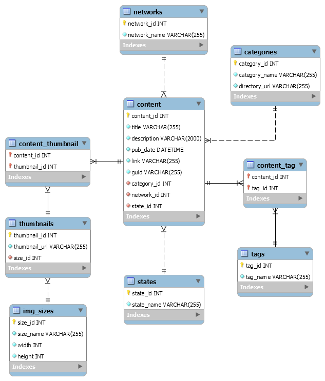

# code-foo-8

IGN Code Foo 8 application

## 1. About me

Hey there. My name is Andy He, and I am a (soon to be graduating) Master's student studying electrical engineering at the University of Minnesota Twin Cities. I'm passionate about art, music, technology, and of course, video games. My earliest experience with video games was watching my brother play Star Fox 64 and Super Mario 64, and getting whupped at Super Smash Bros. on the Nintendo 64. Since then, I've developed an appreciation for all things gaming-related and consider myself a die hard Nintendo fan (proud Wii U owner here).

My interest in gaming has made me a frequent consumer of IGN's content over the past decade, and I have a lot of respect for IGN's presence in the gaming industry. Nowadays, I often look to IGN for video game, movie, and TV show reviews as well as coverage of large events such as E3, SDCC, etc. I also regularly tune in to IGN's weekly Nintendo podcast (and best Nintendo podcast), Nintendo Voice Chat. Aside from all that, the prospect of doing an internship at IGN excites me because I would get to meet and work with people who share my passion for games, gain valuable experience in a professional software development environment, and experience life outside of the Midwest.

Even though my academic background isn't in software engineering, I have had a healthy exposure to a variety of different programming languages and concepts, via both school courses and personal interest. More importantly, I feel that my training as an electrical engineering student has supplied me with the necessary tools to be a competent software developer, namely, strong organizational skills and the patience and resourcefulness to independently seek out solutions. If given the opportunity, I'm confident I can be a positive contributor to whatever project is thrown at me. 

Thank you for your time and consideration!

## 2. Building the Eiffel Tower out of Geomags&#8482;

## 3. ChickenRoad

A Java console application used to calculate paths for crossing a road, represented as a rectangular grid with obstacles.

### Prerequisites

*  Java SE 1.7+

### Usage

To compile the Java program, open a shell instance and navigate to the `ChickenRoad/src/andypasti/chickenroad/` directory. Then use the `javac` command to compile the program:

```
> javac ChickenRoad.java
```

There should now be a .class file in the same directory.

Since the program uses the package `andypasti.chickenroad`, navigate back to the `ChickenRoad/src/` directory. From here, execute the Java class with the command:

```
> java andypasti.chickenroad.ChickenRoad
```

You should now be greeted by the program's introductory text:

```
Input the road grid below, row by row. The letter 'O' represents a traversable space,
while the letter 'X' represents a pothole. Use a semicolon to denote the end of the input.
Input is case-insensitive, and all whitespace will be ignored.
```

The program is now ready to accept your input grids! Here's an example:

Input:
```
O O X X
X O O O
O O X O
O O O O;
```

Output:
```
Road grid:
O O X X
X O O O
O O X O
O O O O

Valid paths when starting at (0, 0):
(0, 0) -> (0, 1) -> (1, 1) -> (1, 2) -> (2, 2) -> (3, 2)
(0, 0) -> (0, 1) -> (1, 1) -> (1, 0) -> (2, 0) -> (3, 0)
(0, 0) -> (1, 0) -> (1, 1) -> (1, 2) -> (2, 2) -> (3, 2)
(0, 0) -> (1, 0) -> (2, 0) -> (3, 0)

Total valid paths from starting point (0, 0) is 4
```

Note: The program selects a starting point at random, so your exact results may vary.

### Input validation

The program performs input validation to prevent bad entries from confusing the algorithm. Specifically, the following cases are checked:
  * Non-rectangular grids, i.e. the number of characters in a row varies
  * Invalid characters, i.e. any characters besides 'X' and 'O'
  * No valid starting points, i.e. the left column of the grid has no traversable spaces
  * Excessive whitespace/newlines
  * Varying letter case

The following 4 inputs represent the same grid to the program:

```
O X O X
O O X O
X O O O
O O O O;
```
```
OXOX
O O O X
XO   OO
O   O  O O;
```
```
o X o X
o o X o
X o o o
O O o O;
```
```
oxox

ooxo

xooo
oooo

;
```

## 4. Back end: RssLoader

A series of PHP scripts used to create tables in a MySQL database, then load them with RSS data from https://ign-apis.herokuapp.com/content/feed.rss.

### Prerequisites

* PHP 5.6+
* MySQL 5.7.X

### Usage

First, connect to your MySQL server and create a database with a name of your choosing. For example:

```
mysql> CREATE DATABASE codefoo8;
```

Note: you will require administrative privileges to perform this action.

Next, open `db_config.php` and replace the placeholder login credentials to that of the desired server, user, and database. For example:

```php
$servername = 'localhost';
$username = 'andy';
$password = 'andy123';
$dbname = 'codefoo8';
```

Make sure the user has been granted all privileges on the database, i.e. `SELECT`, `INSERT`, `UPDATE`, `DELETE`, `CREATE`, `DROP`, and `REFERENCES`.

Now simply execute the following commands from the `RssLoader` directory:

1. `php create_tables.php`
2. `php load_rss_data.php`

**Warning**: If using a pre-existing database, be aware that executing `php create_tables.php` will drop any tables named `content_tag`, `tags`, `content`, `thumbnails`, `img_sizes`, `states`, `networks`, or `categories`.

All done! The tables should now be populated with the RSS data.

### Database design

<p align="center">
  
</p>

The primary data-storing table in the design is the `content` table. This table holds data pertaining to each item in the RSS feed, including the title, description, publication date, URL, and GUID. The `content` table also contains foreign keys referencing the `categories`, `networks`, and `states` tables. These tables exist primarily to enable future expansion/changes and also reduce data redundancy. For example, if IGN were to change its name to, say, JGN, we would only have to update the 'IGN' record in the `networks` table, instead of every single record in the `content` table.

The next tables I'd like to discuss are the `tags` and `thumbnails` tables. The contents of these tables are fairly self-explanatory, but since a single `content` record can potentially have multiple tags and thumbnails, their relationship to the `content` table is a bit more sophisticated. To solve this problem, we introduce the intermediate tables `content_tag` and `content_thumbnail`, which define a many-to-many relationship between the participating tables. Doing this allows each `content` record to have multiple tags/thumbnails. Likewise, each tag/thumbnail can then be associated with multiple `content` records.

Finally, we're left with the `img_sizes` table, which simply serves the same purpose as the `categories`, `networks`, and `states` tables in relation to the `content` table. However, `img_sizes` is instead referenced by the `thumbnails` table.

One last note on data validation: most of the table columns in the database are constrained by `UNIQUE` and `NOT NULL` keywords. This helps to preserve the integrity of the data, preventing duplicate/empty entries. It also greatly simplifies the process of coding the data-loading scripts, allowing them to be agnostic toward the actual contents of the database. You can check the appendix below to see which constraints have been applied to each field.

### Appendix

The following MySQL queries were used to implement the database design:

```sql
CREATE TABLE categories(
  category_id INT PRIMARY KEY AUTO_INCREMENT NOT NULL,
  category_name VARCHAR(255) UNIQUE NOT NULL,
  directory_url VARCHAR(255) UNIQUE NOT NULL
);

CREATE TABLE networks(
  network_id INT PRIMARY KEY AUTO_INCREMENT NOT NULL,
  network_name VARCHAR(255) UNIQUE NOT NULL
);

CREATE TABLE states(
  state_id INT PRIMARY KEY AUTO_INCREMENT NOT NULL,
  state_name VARCHAR(255) UNIQUE NOT NULL
);

CREATE TABLE content(
  content_id INT PRIMARY KEY AUTO_INCREMENT NOT NULL,
  title VARCHAR(255) NOT NULL,
  description VARCHAR(2000) NOT NULL,
  pub_date DATETIME NOT NULL,
  link VARCHAR(255) NOT NULL,
  guid VARCHAR(255) UNIQUE NOT NULL,
  category_id INT NOT NULL,
  network_id INT NOT NULL,
  state_id INT NOT NULL,
  FOREIGN KEY (category_id) REFERENCES categories(category_id),
  FOREIGN KEY (network_id) REFERENCES networks(network_id),
  FOREIGN KEY (state_id) REFERENCES states(state_id)
);

CREATE TABLE img_sizes(
  size_id INT PRIMARY KEY AUTO_INCREMENT NOT NULL,
  size_name VARCHAR(255) UNIQUE NOT NULL,
  width INT NOT NULL,
  height INT NOT NULL
);

CREATE TABLE thumbnails(
  thumbnail_id INT PRIMARY KEY AUTO_INCREMENT NOT NULL,
  thumbnail_url VARCHAR(255) UNIQUE NOT NULL,
  size_id INT NOT NULL,
  FOREIGN KEY (size_id) REFERENCES img_sizes(size_id)
);

CREATE TABLE tags(
  tag_id INT PRIMARY KEY AUTO_INCREMENT NOT NULL,
  tag_name VARCHAR(255) UNIQUE NOT NULL
);

CREATE TABLE content_tag(
  content_id INT NOT NULL,
  tag_id INT NOT NULL,
  PRIMARY KEY (content_id, tag_id),
  FOREIGN KEY (content_id) REFERENCES content(content_id),
  FOREIGN KEY (tag_id) REFERENCES tags(tag_id)
);

CREATE TABLE content_thumbnail(
  content_id INT NOT NULL,
  thumbnail_id INT NOT NULL,
  PRIMARY KEY (content_id, thumbnail_id),
  FOREIGN KEY (content_id) REFERENCES content(content_id),
  FOREIGN KEY (thumbnail_id) REFERENCES thumbnails(thumbnail_id)
);
```

## Survey

I discovered this application via Twitter post by @IGN.